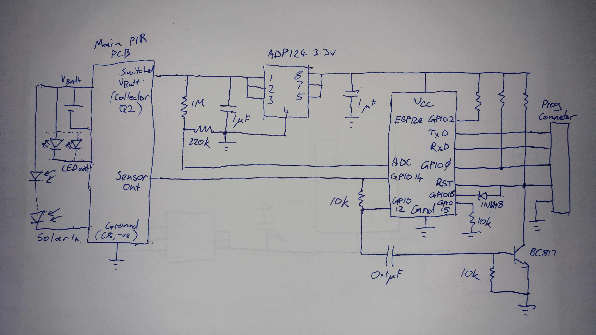
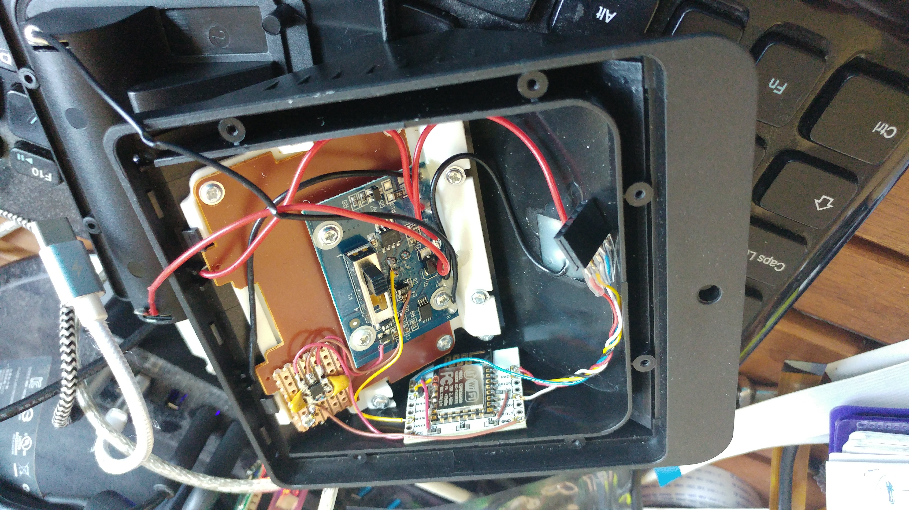

# pir-switch-esp12e
Simple nodemcu lua script for use in a solar powered PIR sensor. Sensor output and battery voltage are pushed to an MQTT server

This was fitted into this solar sensor light:
https://www.amazon.co.uk/Mpow-Security-Waterproof-Intelligient-Driveway/dp/B016XYU7A4/ref=sr_1_7?ie=UTF8&qid=1538309900&sr=8-7

A track was cut on the underside of the PCB to disable the light on the first switch setting allowing the sensor to work in "stealth" mode. The track leads from the bottom row of switch contacts corresponding to the first position. The common on this row is connected to ground (No photo as yet) 
